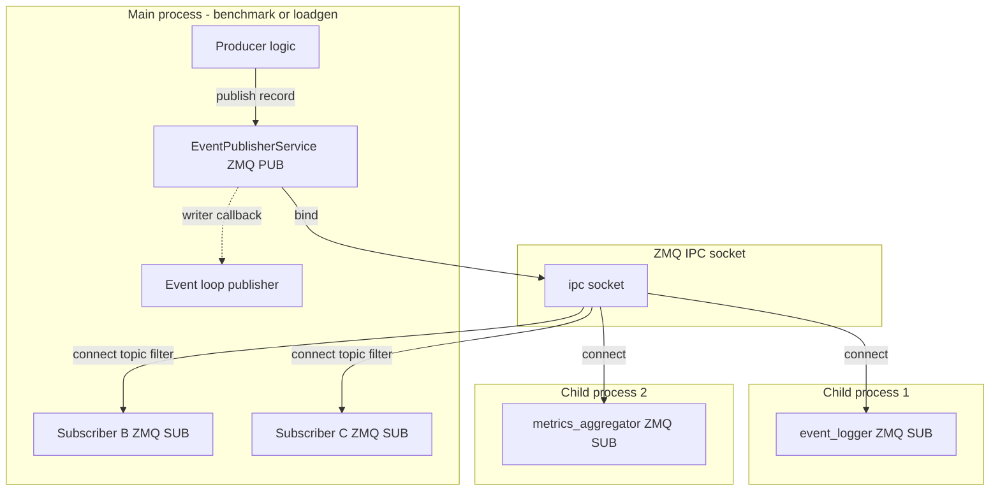
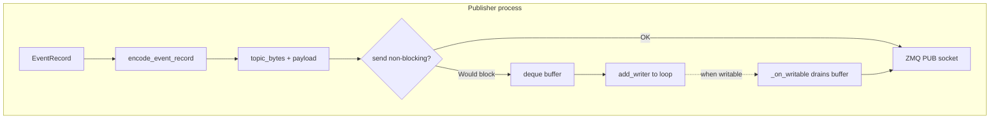
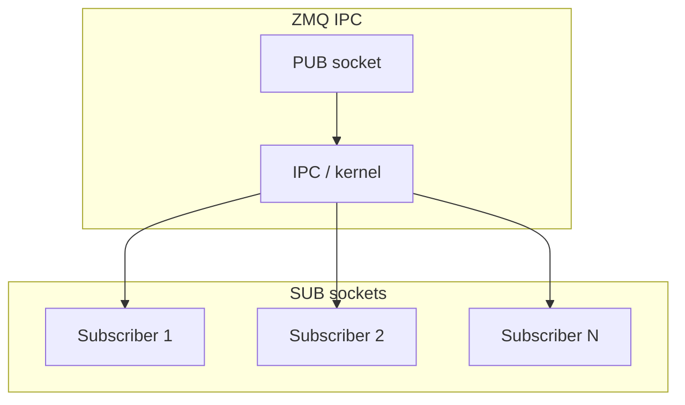
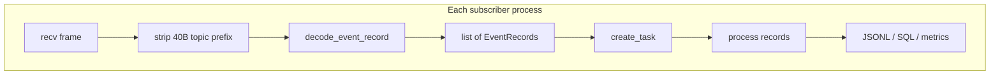
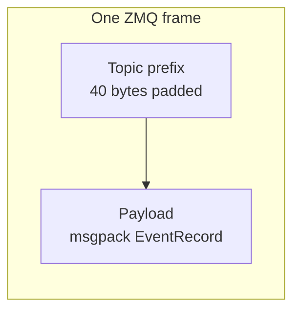
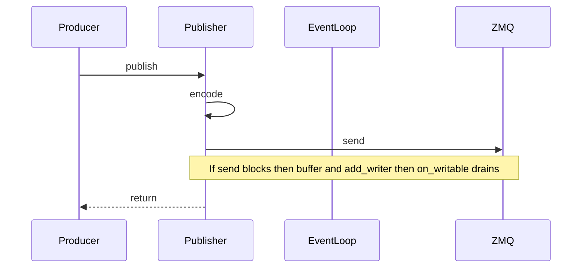
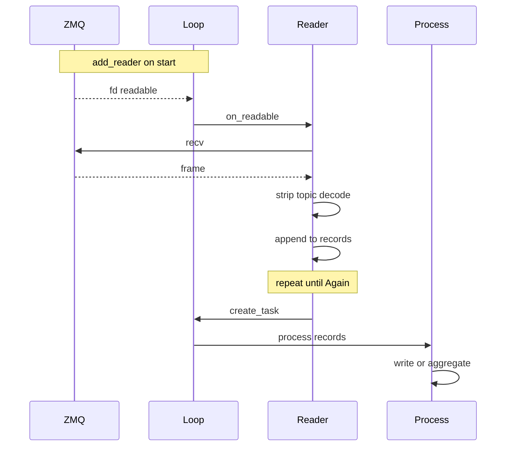
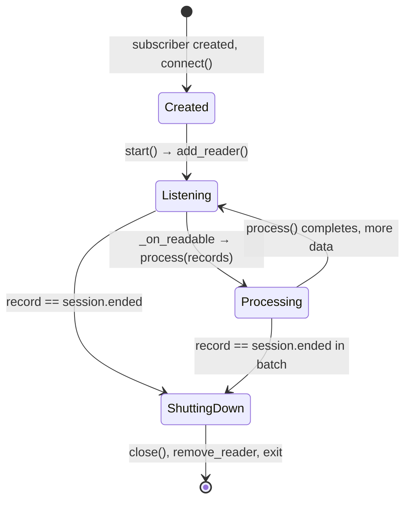

# System Design: EventRecord Pub-Sub

This document describes the design of the pub-sub system for **EventRecords**: how events are published from the inference/benchmark path, how subscribers receive and process them, and how process separation, latency, de-sync, and async behavior are handled.

---

## 1. Process separation

### 1.1 Roles

| Role            | Process                                | Description                                                                                                                                                                                  |
| --------------- | -------------------------------------- | -------------------------------------------------------------------------------------------------------------------------------------------------------------------------------------------- |
| **Publisher**   | Main process (benchmark/loadgen)       | Holds `EventPublisherService` (singleton). Binds a ZMQ PUB socket to an IPC (or TCP) address. Publishes `EventRecord` instances as events occur (e.g. sample issued, first token, complete). |
| **Subscribers** | Same process and/or separate processes | Connect to the publisher's address via ZMQ SUB sockets. Each runs its own event loop (if async). Filter by topic and process batches of decoded `EventRecord`s.                              |

The publisher is created inside a **scoped** `ManagedZMQContext` (e.g. in the main process). The **bind address** (e.g. `ipc:///path/to/socket_dir/ev_pub_<uuid>`) is chosen by the publisher and must be passed to any subscriber (in-process or out-of-process) so they can **connect** to it.

### 1.2 In-process vs out-of-process subscribers

- **In-process**: Subscriber runs in the same process as the publisher but on a **different event loop** (e.g. `LoopManager().create_loop("subscriber_name")`). It uses the same `ManagedZMQContext` (same `socket_dir`) and connects to the publisher's `bind_address`. Example: `ConsoleSubscriber`, `DurationSubscriber` in the demo.
- **Out-of-process**: Subscriber runs in a **separate process** (e.g. `subprocess.Popen`). That process creates its own `ManagedZMQContext` with a **shared socket directory** (e.g. `socket_dir=log_dir.parent` so the IPC path exists and is writable). It is passed the publisher's address via CLI (e.g. `--socket-address <address>`) and connects to it. Example: **event_logger** and **metrics_aggregator** services launched from the demo/benchmark.

So: one publisher process; zero or more subscribers in the same process (each with its own loop) and/or in child processes (each with its own context and loop). All subscribers share the same logical stream of events (subject to topic filters and to de-sync; see §3).

### 1.3 ZMQ context and socket directory

- **ManagedZMQContext** is a per-process singleton. It owns the ZMQ context and a **socket directory** used for IPC paths.
- The publisher **binds** in that directory (e.g. `ipc://{socket_dir}/ev_pub_{uuid}`).
- Subscribers in the same process use the same context and connect to that address. Subscribers in another process must be given the same **path** (same `socket_dir` and relative path), so the parent typically passes `socket_dir` (e.g. log_dir.parent) and the full `bind_address` (or socket_dir + well-known suffix) to the child.
- Cleanup: when the scoped context in the publisher process exits, it closes sockets and terminates the context; the publisher also unlinks the IPC file. Subscriber processes must connect before the publisher exits and should shut down when they see `session.ended` (or similar) to avoid using a closed socket.

### 1.4 Process architecture diagram

---

## 2. Latency

### 2.1 Publisher side

- **Send path**: `publish(event_record)` encodes the record (msgpack + topic) and calls `send(topic, payload)`. The ZMQ implementation sends a **single frame** (topic + payload) for efficiency.
- **Non-blocking send**: If the socket would block, the message is appended to an internal **deque** and an asyncio **writer** is registered on the socket's FD. When the socket becomes writable, the writer drains the buffer. So the caller is not blocked by slow subscribers; at most it pays the cost of encoding and a deque append.
- **Eager mode**: If the publisher was created with `extra_eager=True`, it has no loop and uses blocking send; `publish()` blocks until the message is sent. This is for tests or when strict ordering/back-pressure is required.
- **Socket options**: `SNDHWM=0` (no send high-water mark), `LINGER=-1` (on close, wait until pending messages are sent), `IMMEDIATE=1` (don't queue for disconnected peers). So the publisher does not drop messages due to HWM and tries to avoid buffering for subscribers that are not connected.

### 2.2 Subscriber side

- **Receive path**: The subscriber's socket is registered with asyncio via `add_reader(_fd, _on_readable)`. When data is available, `_on_readable` runs: it **drains** the socket in a loop (non-blocking recv until `zmq.Again`), decodes each payload into an `EventRecord`, and appends to a list. When no more messages are available, it **schedules** `process(records)` with `loop.create_task(...)`. So the read path is non-blocking and does minimal work; heavy work runs in the async `process()`.
- **Back-pressure**: ZMQ SUB has `RCVHWM=0` (unlimited receive buffer). If the subscriber's `process()` is slow, messages accumulate in the ZMQ buffer and in the kernel. There is no application-level flow control back to the publisher; the publisher only blocks (or buffers) when its own send buffer or socket is full.

### 2.3 End-to-end latency

- **Encoding**: One msgpack encode per record; topic is fixed-size (40 bytes) + payload.
- **Transport**: IPC avoids network stack; single-frame send reduces syscalls.
- **Decode**: One msgpack decode per message in the subscriber's read path; then one `create_task(process(records))` per batch. So latency from publish to start of `process()` is dominated by encode, kernel IPC, and decode; actual processing runs asynchronously and does not block the next batch.

---

## 3. De-sync issues between subscribers and how to handle them

### 3.1 No guaranteed ordering across subscribers

- Each subscriber receives messages in **publish order** on its own socket. Different subscribers may progress at different rates (e.g. one does I/O, one is CPU-bound). So **relative order between subscribers is not defined**; there is no global “event clock” that all subscribers share.
- If a downstream system needs a single ordered log, that should be produced by **one** subscriber (e.g. event_logger) that writes to a single file or DB.

### 3.2 Late-joining subscribers

- ZMQ PUB/SUB does **not** retain messages. A subscriber that connects **after** some events have been published will **not** receive those events. There is no replay or catch-up.
- **Practice**: Start all subscribers (in-process or subprocess) **before** starting the load or publishing meaningful events. The demo/benchmark should create and `start()` subscribers, then run the benchmark, then publish `session.ended`.

### 3.3 Missed or duplicate events

- **Missed**: If a subscriber process crashes or is killed, it misses all events from that point. The publisher does not track subscriber liveness. Restarting the subscriber does not replay; it only receives new events from the time it connects.
- **Duplicate**: The same event is sent to every connected subscriber once. If a subscriber reconnects (e.g. restart), it will not get old events again; it only gets new ones. So duplicates are not introduced by the transport. Duplicates could only occur if the publisher logic published the same event twice.

### 3.4 Graceful shutdown and session.ended

- The publisher sends a **session.ended** event (topic `session.ended`) when the session is finished. Subscribers are expected to:
  - Treat **session.ended** as “no more events will be sent.”
  - Optionally flush buffers, close writers, and exit (e.g. event_logger closes files and sets a shutdown event so the process can exit).
- Subscribers that filter by topic must subscribe to `session.ended` (or subscribe to all topics) if they need to shut down cleanly. After **session.ended**, the publisher may close its socket; subscribers that continue to recv may see errors or EOF.

### 3.5 Malformed messages

- If a payload cannot be decoded as an `EventRecord`, the subscriber creates a synthetic **error** record (`ErrorEventType.GENERIC` with `ErrorData(error_type="msgspec.DecodeError", ...)`) and passes it into `process(records)`. So the stream of records is not interrupted; the implementation can log or store error events as needed.

---

## 4. Data flow

### 4.1 EventRecord and encoding

- **EventRecord** (in `core.record`): `event_type` (an `EventType`), `timestamp_ns`, `sample_uuid`, `data` (optional; type `OUTPUT_TYPE | ErrorData | None`). Event types are grouped by category (e.g. `session`, `error`, `sample`); each member has a **topic** string `category.value` (e.g. `session.started`, `sample.complete`).
- **Encoding**: `encode_event_record(record)` returns `(topic_bytes_padded, payload_bytes)`. Topic is padded to **TOPIC_FRAME_SIZE** (40 bytes) for fixed-size prefix. Payload is msgpack-encoded `EventRecord` (with custom enc/dec hooks so `event_type` is stored as the topic string). The ZMQ layer sends **one frame** = `topic_bytes_padded + payload_bytes`.

### 4.2 Topics and filtering

- **Topics** are strings like `session.started`, `session.ended`, `sample.issued`, `sample.complete`, `error.generic`, etc. Subscribers can subscribe to:
  - **All topics**: `topics=None` or subscribe to `b""`.
  - **A subset**: pass a list of topic strings; the ZMQ SUB socket subscribes to each (prefix match in ZMQ 4.x is by subscription string; our topics are full strings).
- Only messages whose topic matches the subscription are delivered. So each subscriber sees a subset of the global stream defined by its topic filter.

### 4.3 Flow summary

1. **Producer** (e.g. worker/benchmark) creates an `EventRecord` and calls `EventPublisherService.publish(record)`.
2. **EventPublisherService** (ZMQ PUB): encodes to (topic, payload), sends one frame. If send would block, buffers and drains via asyncio writer.
3. **ZMQ** delivers the frame to every connected SUB socket that matches the topic.
4. **Subscriber** (ZMQ SUB): `_on_readable` recvs frames, strips the 40-byte topic prefix, decodes payload to `EventRecord`, batches records, and calls `loop.create_task(process(records))`.
5. **process(records)**: Subclass-specific (e.g. write to JSONL/SQL, aggregate metrics, or log to console). Runs asynchronously; can be slow without blocking the socket read path.

### 4.4 Data flow diagram

Data flow is split into two diagrams (publisher side, then subscriber side) for readability. Both use top-to-bottom layout.

**Publisher side — from event to socket (or buffer):**

**Transport — fan-out to subscribers:**

**Subscriber side — from socket to process:**

**Message format (single ZMQ frame):**

---

## 5. Async / parallel execution flow (pub and sub)

### 5.1 Publisher process

- **Event loop**: The publisher may use the main process's default loop or a dedicated loop (e.g. `LoopManager().create_loop("ev_pub")`), or no loop (eager mode).
- **publish()**: Called from whatever thread/context produces events (e.g. main thread during benchmark). It does:
  - Encode.
  - Try non-blocking send; if it fails with “again”, push to buffer and, if needed, register `add_writer(_fd, _on_writable)`.
- **Writer callback**: When the socket is writable, the loop runs `_on_writable`, which drains the buffer. So the actual send happens on the **loop's thread**. If the producer thread is not the loop thread, `publish()` is effectively “fire-and-forget” plus optional buffer; the loop thread does the send later. No explicit lock is required around the buffer because only the loop thread drains it and the producer only appends (deque is not thread-safe for concurrent push/pop from different threads; in practice the loop is often the same as the producer, or the design avoids concurrent publish from multiple threads).

  - **Note**: If multiple threads call `publish()`, the deque append is not thread-safe. Typical use is single-threaded event production on the same loop that runs the writer, or external synchronization.

### 5.2 Subscriber process (or in-process subscriber)

- **Event loop**: Each subscriber has its **own** event loop (e.g. from `LoopManager().create_loop(...)` or the default loop in a subprocess). Subscribers do **not** share the publisher's loop.
- **Reader**: When `start()` is called, the subscriber registers `add_reader(_fd, _on_readable)` with its loop. So the socket is only read when that loop is running (e.g. `run_until_complete(main())` or equivalent).
- **\_on_readable**: Runs on the subscriber's loop thread. Drains socket, decodes, then `create_task(self.process(records))`. So `process()` runs on the **same** loop, but after the current callback returns; multiple batches can be “in flight” (multiple tasks) if recv is faster than process. No explicit locking is shown; concurrency is at the level of “many tasks on one loop.”
- **Shutdown**: When the subscriber sees `session.ended`, it may call `close()`, which removes the reader and closes the socket. The event loop can then exit (e.g. `shutdown_event.set()` and `await shutdown_event.wait()` in the demo).

### 5.3 Parallelism summary

| Component                | Where it runs                            | Blocking?                                          |
| ------------------------ | ---------------------------------------- | -------------------------------------------------- |
| publish()                | Caller thread (often main/loop thread)   | No (unless eager); at most encode + buffer append. |
| Publisher send/drain     | Loop thread (writer callback)            | No; non-blocking drain.                            |
| Subscriber recv + decode | Subscriber loop thread (reader callback) | No; non-blocking recv.                             |
| process(records)         | Subscriber loop (async task)             | Can be long-running; does not block recv.          |

So: **publisher** and **subscribers** can run in different processes; within a process, publisher and subscribers use different loops. Work is kept off the hot path (decode + create_task on subscriber; encode + optional buffer on publisher). No shared mutable state between pub and sub beyond the ZMQ socket and kernel buffers.

### 5.4 Execution sequence: publish path

### 5.5 Execution sequence: subscribe path

### 5.6 Subscriber lifecycle (session.ended)

---

## 6. Subscriber services (overview)

### 6.1 Event logger

- **Role**: Subscribes to all (or a configured set of) topics and **persists** event records.
- **Outputs**: JSONL and/or SQL (SQLAlchemy; default sqlite). Writers are pluggable (`RecordWriter`); each record is written to all configured writers.
- **Lifecycle**: On **session.ended**, it stops accepting new non-error events, flushes and closes writers, and signals shutdown (e.g. sets an event so the process can exit). Error events after **session.ended** are still written so that failures during shutdown are not dropped.
- **Process**: Typically run as a **subprocess**; given `--log-dir` and `--socket-address` (and optionally `--writers jsonl sql`). Uses the same socket directory as the publisher (e.g. log_dir.parent) so IPC path is valid.

### 6.2 Metrics aggregator

- **Role**: Subscribes to EventRecords and derives real-time metrics (e.g. TTFT, sample latency, token counts). May use a tokenizer pool for token-based metrics. Shuts down on **session.ended**.
- **Outputs**: Planned is to push real time metrics to Prometheus via PushGateway. Currently, logging / writing final report to JSON is sufficient legacy behavior.
- **Process**: Run as a **subprocess**; given `--metrics-dir`, `--socket-address`, and optional tokenizer options. Uses a dedicated event loop and `ManagedZMQContext.scoped(socket_dir=...)` so it can connect to the publisher's IPC address.

---

## 7. References

- **Protocol and types**: `async_utils.transport.protocol` (`EventRecordPublisher`, `EventRecordSubscriber`), `core.record` (EventRecord, EventType, encode/decode), `core.types` (e.g. ErrorData, OUTPUT_TYPE).
- **ZMQ implementation**: `async_utils.transport.zmq.pubsub` (`ZmqEventRecordPublisher`, `ZmqEventRecordSubscriber`), `async_utils.transport.zmq.context` (`ManagedZMQContext`).
- **Publisher singleton**: `async_utils.event_publisher.EventPublisherService`.
- **Demo**: `scripts/zmq_pubsub_demo.py` (publisher, in-process and subprocess subscribers, session.ended flow).
- **Event logger**: `async_utils.services.event_logger` (CLI, JSONLWriter, SQLWriter, EventLoggerService).
