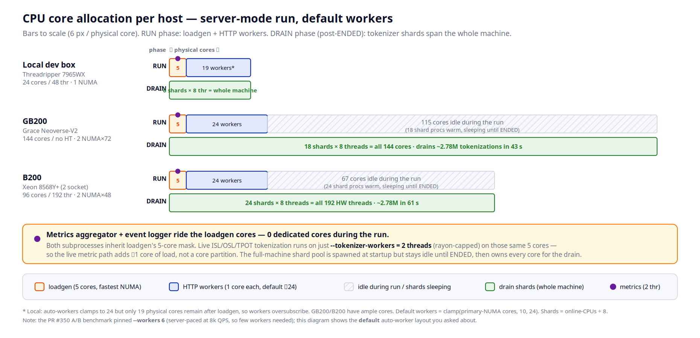

# Metrics Aggregator Service — Design

The metrics aggregator is a subprocess (`python -m
inference_endpoint.async_utils.services.metrics_aggregator`) that subscribes
to the EventRecord stream, folds per-sample events into a `MetricsRegistry`,
and publishes `MetricsSnapshot` frames over IPC PUB at a fixed cadence. At
end-of-run it atomically writes `final_snapshot.json` — the **primary** source
for `Report`; the terminal pub/sub frame is only a TUI "run finished" signal.

## Lifecycle

```
INITIALIZE ──STARTED──► LIVE ──ENDED──► DRAINING ──► COMPLETE
     │           │           │              │
     └───────────┴───────────┴──────────────┴──► INTERRUPTED  (SIGTERM)
```

The SIGTERM handler is installed before `STARTED` and finalizes regardless of
state, so `INTERRUPTED` is reachable from any state, not only `DRAINING`.

The ENDED path runs inside a finalization boundary: whatever the drain does —
finish, time out, or fail — `publish_final` and the shutdown signal always
run. A tokenizer failure can degrade the snapshot (see the `n_pending_tasks`
contract) but can never hang the subprocess. SIGTERM writes a best-effort
partial snapshot tagged `INTERRUPTED`.

## Token metrics pipeline

ISL/OSL/TPOT require tokenizer passes per completed sample; at high completion
rates a per-event dispatch model accumulates an unbounded backlog. The
pipeline batches instead: **defer-to-flush** + **process-sharded encoding**.

### Defer-to-flush (`TokenBatchQueue`)

Triggers do no work at event time — `fire()` appends `(text, on_count)` to a
buffer, O(1), no tasks. The buffer is cleared at two points:

1. **Live loop** — `start_live(interval)` flushes periodically through the
   tokenizer's in-process lane: `--tokenizer-workers` threads, rayon capped
   to the same width, at most `_LIVE_FLUSH_MAX_ITEMS` per flush. Never
   touches the shard processes. `0` disables mid-run tokenization. Failed or
   cancelled live items are **re-queued** — the drain retries them.
2. **End-of-run** — `flush_remaining(timeout)` stops the live loop and drains
   everything left through every shard, bounded by the drain budget.

`flush()` serializes under an asyncio lock and detaches the buffer up front.
The text and chat-template phases fail independently; a raising recorder is
logged without aborting the batch. Drain failures are terminal — items stay
counted in `pending`. `flush_remaining` never raises.

### Sharded batch encoding (`BatchTokenizer`)

The drain fans the whole buffer out across worker **processes**, one pinned
per `CORES_PER_WORKER` (8) core block. Each worker runs the raw `tokenizers`
backend's `encode_batch_fast` (Rust, rayon); a single BPE rayon pool
saturates ~8 cores, so disjoint pinned blocks are how the whole machine is
used. Workers are spawn-context, warmed in parallel at construction (bounded
— a hung load is a startup error), and ignore SIGINT.

The shard pool has no knob: it auto-sizes to one shard per 8-core block of
the allowed CPU universe. There is no fallback — no fast Rust backend, or a
failed/over-budget warmup, is a startup error, because an in-process slow
path cannot keep up and would surface much later as an incomplete drain.
Platforms without an affinity API (macOS) shard unpinned; each worker caps
its rayon pool to the block size instead.

Workers ignore SIGINT so an interactive ^C (delivered to the whole process
group) cannot kill a shard mid-drain on its own. Interrupting a run is not
lost: the parent catches the signal, runs its graceful shutdown, and then
SIGTERM-kills the aggregator child — which the aggregator's SIGTERM handler
turns into a best-effort `INTERRUPTED` final snapshot.

Chat-template items (tool calls) run on the in-process thread lane —
`apply_chat_template` is Python/Jinja; sharding buys nothing.

### CPU affinity: tokenize is post-run

The parent pins itself to the loadgen cores and children inherit that narrow
mask. `_setup_shards` probes the full allowed universe via
`expand_to_all_online_cpus()` (cgroup/Slurm-clamped) for the block math,
**then restores the inherited mask** — the aggregator stays where the parent
placed it; only the drain-phase shard children span the machine, and they
are idle until `ENDED`.



### The `n_pending_tasks` contract

`TokenBatchQueue.pending` (enqueued-but-not-recorded) is surfaced on every
snapshot as `n_pending_tasks`. In the final snapshot:

- `state == complete && n_pending_tasks == 0` — clean run, exact series.
- `state == complete && n_pending_tasks > 0` — **incomplete drain** (budget
  exhausted or tokenizer failed); `Report` renders a warning. Failed items
  are deliberately not removed from the count — under-reporting would
  rebadge an incomplete drain as clean.

### Data flow

```
COMPLETE event ─► trigger.fire ─► queue.enqueue(text, on_count)        [O(1)]
                                       │
  live loop (publish cadence) ─ flush(live) ─► in-process threads (rayon-capped)
  ENDED drain (budgeted) ────── flush() ─────► chunks ─► N pinned worker procs
                                                  └─► on_count(n) ─► registry.record()
```

## CLI

| Flag                             | Default         | Purpose                                             |
| -------------------------------- | --------------- | --------------------------------------------------- |
| `--socket-dir` / `--socket-name` | required        | EventRecord SUB socket                              |
| `--metrics-socket`               | required        | Snapshot PUB socket name                            |
| `--metrics-output-dir`           | required        | Directory for `final_snapshot.json`                 |
| `--publish-interval`             | 0.25            | Live snapshot cadence (seconds)                     |
| `--drain-timeout`                | `0` (unlimited) | End-of-run tokenize budget (`0` = unlimited)        |
| `--tokenizer`                    | none            | HF name or local path; unset disables token metrics |
| `--tokenizer-workers`            | `2`             | Live in-process threads (`0` = defer all to drain)  |
| `--streaming`                    | off             | Register TTFT/chunk-delta/TPOT triggers             |

`--drain-timeout` and `--tokenizer-workers` have service-side defaults (`0`
and `2`) so the service is launchable by hand without tuning knobs, but
`config/schema.py` is the single source of truth: the benchmark always
forwards the schema values (`--metrics-drain-timeout`,
`--metrics-tokenizer-workers`), overriding these defaults in normal runs.

## References

- [docs/async_utils/services/DESIGN.md](../DESIGN.md) — the EventRecord
  pub/sub system this service subscribes to.
- [docs/PERF_ARCHITECTURE.md](../../../PERF_ARCHITECTURE.md) — CPU pinning
  for the loadgen/worker hot path.
