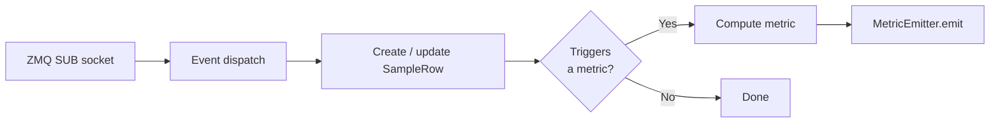
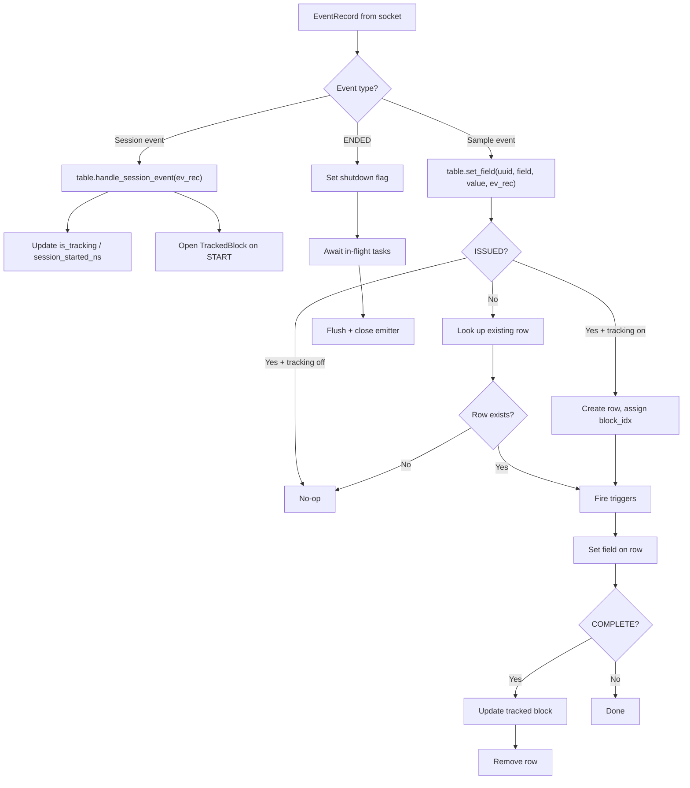
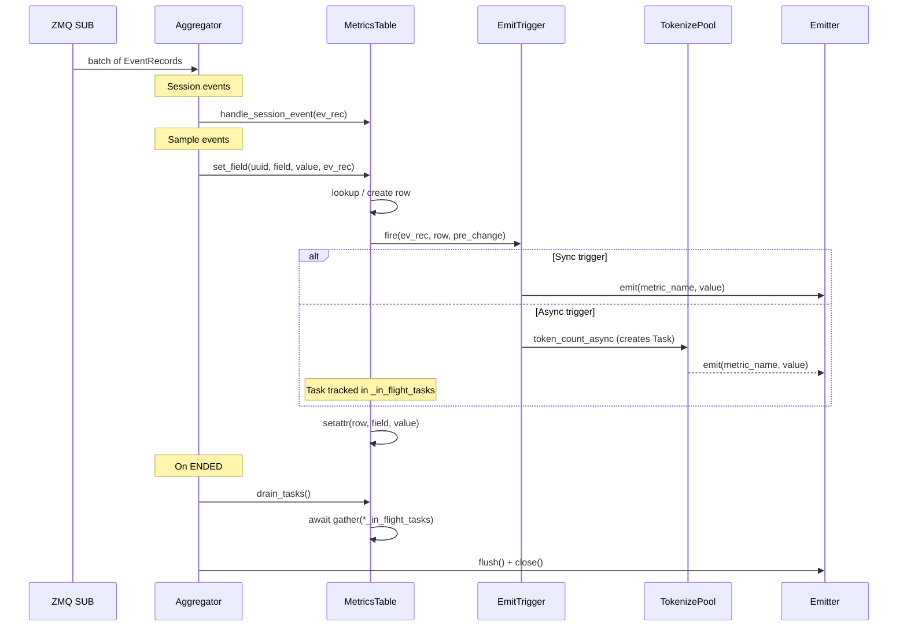
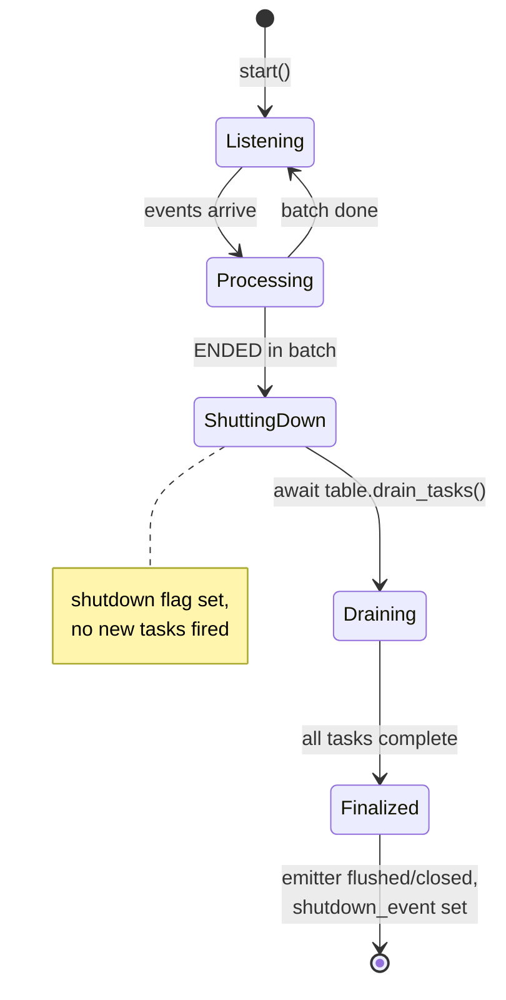

# Metrics Aggregator Service — Design Document

## Overview

The metrics aggregator receives `EventRecord` messages from a ZMQ SUB socket,
computes per-sample metrics in real time, and pushes them to a `MetricEmitter`
backend (currently JSONL; future: Prometheus PushGateway).



## Module Layout

```
metrics_aggregator/
├── __init__.py
├── __main__.py          # CLI entry point
├── aggregator.py        # MetricsAggregatorService (thin event router)
├── emitter.py           # MetricEmitter ABC, JsonlMetricEmitter
├── metrics_table.py     # SampleRow, TrackedBlock, MetricsTable, EmitTrigger, triggers
└── token_metrics.py     # TokenizePool (thread-pool tokenizer)
```

## Architecture

### Component Roles

| Component                    | Responsibility                                                                                                                                                                                                                                                       |
| ---------------------------- | -------------------------------------------------------------------------------------------------------------------------------------------------------------------------------------------------------------------------------------------------------------------- |
| **MetricsAggregatorService** | Thin event router. Receives EventRecord batches, dispatches session events to `MetricsTable.handle_session_event()` and sample events to `MetricsTable.set_field()`. Owns shutdown logic.                                                                            |
| **MetricsTable**             | Owns sample rows, session state, trigger registry, tracked blocks, and in-flight task tracking. Handles row lifecycle (create on ISSUED, remove on COMPLETE), trigger dispatch, and tracked duration bookkeeping.                                                    |
| **SampleRow**                | Pure data container (`dataclass(slots=True)`). Holds per-sample timestamps and a `tracked_block_idx` linking it to its tracking window. No methods, no trigger awareness.                                                                                            |
| **EmitTrigger**              | ABC for metric computations. Each trigger binds runtime deps (emitter, tokenize_pool, loop) at construction. `fire(ev_rec, row, pre_change)` is called by MetricsTable when a field is set. Must be non-blocking; returns an `asyncio.Task` if async work is needed. |
| **TrackedBlock**             | Per-tracking-window duration state. Tracks `start_ns`, `last_complete_ns`, and `completed_samples`. Duration extends to the last sample completion, not to STOP_PERFORMANCE_TRACKING.                                                                                |

### Trigger System

Triggers are registered on `MetricsTable` at aggregator construction time:

```python
table = MetricsTable()
table.add_trigger("recv_first_ns", TtftTrigger(emitter))
table.add_trigger("complete_ns", SampleLatencyTrigger(emitter))
table.add_trigger("complete_ns", OslTpotTrigger(emitter, tokenize_pool, loop))
```

Each trigger has:

- `metric_name`: identifies the metric being computed.
- `requires`: tuple of SampleRow field names whose **pre-change** values are
  snapshotted and passed to `fire()`.

When `MetricsTable.set_field(uuid, field_name, value, ev_rec)` is called:

1. Look up the row (or create it if ISSUED + tracking is on).
2. For each trigger registered on `field_name`:
   a. Snapshot `{attr: getattr(row, attr) for attr in trigger.requires}`.
   b. Call `trigger.fire(ev_rec, row, pre_change)`.
   c. If a Task is returned, add it to `_in_flight_tasks`.
3. Set `row.field_name = value`.
4. If COMPLETE, update the tracked block and remove the row.

This means triggers see the row state **before** the update. This is critical for
`chunk_delta_ns`, which needs the previous `last_recv_ns` value.

## Subscribed Events

### Session Events

| Event                                         | Effect                                                                     |
| --------------------------------------------- | -------------------------------------------------------------------------- |
| `SessionEventType.STARTED`                    | Records `session_started_ns` on MetricsTable                               |
| `SessionEventType.START_PERFORMANCE_TRACKING` | Sets `is_tracking = True`, opens a new `TrackedBlock`                      |
| `SessionEventType.STOP_PERFORMANCE_TRACKING`  | Sets `is_tracking = False` (tracked blocks keep extending via completions) |
| `SessionEventType.ENDED`                      | Triggers shutdown: drain in-flight tasks, then finalize                    |

### Sample Events

| Event              | Field Set                       | Trigger(s) Fired                                                                              |
| ------------------ | ------------------------------- | --------------------------------------------------------------------------------------------- |
| `ISSUED`           | `issued_ns`                     | `IslTrigger`                                                                                  |
| `RECV_FIRST`       | `recv_first_ns`, `last_recv_ns` | `TtftTrigger`, `FirstChunkTokenCountTrigger`, `ChunkDeltaTrigger` (skips: pre-change is None) |
| `RECV_NON_FIRST`   | `last_recv_ns`                  | `ChunkDeltaTrigger`                                                                           |
| `CLIENT_SEND`      | `client_send_ns`                | (none)                                                                                        |
| `CLIENT_RESP_DONE` | `client_resp_done_ns`           | `RequestDurationTrigger`                                                                      |
| `COMPLETE`         | `complete_ns`                   | `SampleLatencyTrigger`, `OslTpotTrigger`                                                      |

Ignored: `TRANSPORT_SENT`, `TRANSPORT_RECV` (infrastructure-level).

## Performance Tracking and Tracked Duration

### Tracking Windows

`is_tracking` defaults to `False`. No samples are tracked until
`START_PERFORMANCE_TRACKING` is received. This allows warmup queries to be excluded.

```
  STARTED                                                      ENDED
    │                                                            │
    ▼                                                            ▼
────┬─────────┬───────────────────────────────┬──────────────────┬──
    │  warmup │  ◄── samples issued here      │  cooldown        │
    │         │      are tracked              │                  │
    │   START_PERF_TRACKING            STOP_PERF_TRACKING        │
    │         │                               │                  │
    │         │◄── block 0 ──────────────────►│                  │
    │         │   (extends to last completion) │                  │
```

- A sample is tracked **if and only if** its ISSUED event arrives while
  `is_tracking == True`.
- Once tracked, the sample continues to receive events and emit metrics
  regardless of later STOP events.
- Duplicate START events (while already tracking) are no-ops.

### TrackedBlock

Each `START_PERFORMANCE_TRACKING` (when not already tracking) opens a new
`TrackedBlock`:

```python
@dataclass(slots=True)
class TrackedBlock:
    start_ns: int               # timestamp of START_PERFORMANCE_TRACKING
    last_complete_ns: int       # max completion timestamp (init = start_ns)
    completed_samples: int = 0  # count of completions in this block
```

When a tracked sample completes:

- `block.last_complete_ns = max(block.last_complete_ns, complete_ns)`
- `block.completed_samples += 1`

`block.duration_ns = last_complete_ns - start_ns`

This means block duration extends to the **last tracked completion**, not to
STOP_PERFORMANCE_TRACKING. Samples issued during tracking but completing after
STOP still contribute to their block's duration.

### Aggregate Metrics

```
total_tracked_duration_ns = sum(block.duration_ns for block in tracked_blocks)
total_completed_tracked_samples = sum(block.completed_samples for block in tracked_blocks)
QPS = total_completed_tracked_samples / total_tracked_duration_ns
```

An empty block (START → STOP with no samples) has `duration_ns = 0` and
`completed_samples = 0`, contributing nothing to either sum.

### Multiple Tracking Windows Example

```
t=0:    START → block 0 (start=0)
t=100:  ISSUED s1 (block_idx=0)
t=200:  ISSUED s2 (block_idx=0)
t=300:  STOP → is_tracking=False
t=400:  ISSUED s3 (untracked, is_tracking=False)
t=600:  COMPLETE s1 → block 0: last_complete=600, completed=1
t=700:  COMPLETE s2 → block 0: last_complete=700, completed=2
t=800:  START → block 1 (start=800)
t=900:  ISSUED s4 (block_idx=1)
t=1000: COMPLETE s4 → block 1: last_complete=1000, completed=1

block 0: duration = 700 - 0 = 700, samples = 2
block 1: duration = 1000 - 800 = 200, samples = 1
total_tracked_duration = 900
QPS = 3 / 900
```

## Data Model: SampleRow

A pure `dataclass(slots=True)` — no methods, no trigger awareness:

```python
@dataclass(slots=True)
class SampleRow:
    sample_uuid: str
    tracked_block_idx: int = -1       # -1 = untracked (should never happen with current gate)
    issued_ns: int | None = None
    recv_first_ns: int | None = None
    last_recv_ns: int | None = None
    client_send_ns: int | None = None
    client_resp_done_ns: int | None = None
    complete_ns: int | None = None
    first_chunk_token_count: int | None = None  # set async by FirstChunkTokenCountTrigger
```

Compared to the previous design:

- **Dropped**: `prompt_text` (ISL trigger reads from `ev_rec.data` directly),
  `first_chunk_text` (replaced by `first_chunk_token_count`, computed eagerly at
  RECV_FIRST), `output_chunks` (COMPLETE carries full output via TextModelOutput).
- **Added**: `tracked_block_idx` (links sample to its tracking window),
  `first_chunk_token_count` (pre-computed token count for TPOT denominator).
- **Changed from msgspec.Struct to dataclass**: SampleRow is never serialized, only
  used as a temporary in-memory container. `dataclass(slots=True)` provides similar
  performance without msgspec constraints.

## Metrics Computed

### Timing Metrics (sync triggers, emitted immediately)

| Metric                | Trigger                  | Field                 | Formula                                                                          |
| --------------------- | ------------------------ | --------------------- | -------------------------------------------------------------------------------- |
| `ttft_ns`             | `TtftTrigger`            | `recv_first_ns`       | `ev_rec.timestamp_ns - pre_change["issued_ns"]`                                  |
| `chunk_delta_ns`      | `ChunkDeltaTrigger`      | `last_recv_ns`        | `ev_rec.timestamp_ns - pre_change["last_recv_ns"]` (skips if pre-change is None) |
| `request_duration_ns` | `RequestDurationTrigger` | `client_resp_done_ns` | `ev_rec.timestamp_ns - pre_change["client_send_ns"]`                             |
| `sample_latency_ns`   | `SampleLatencyTrigger`   | `complete_ns`         | `ev_rec.timestamp_ns - pre_change["issued_ns"]`                                  |

### Token Metrics (async triggers, fire tasks)

| Metric                     | Trigger                       | Field           | Source                                                                           |
| -------------------------- | ----------------------------- | --------------- | -------------------------------------------------------------------------------- |
| `isl`                      | `IslTrigger`                  | `issued_ns`     | `len(ev_rec.data.token_ids)` (sync) or `token_count(ev_rec.data.text)` (async)   |
| `_first_chunk_token_count` | `FirstChunkTokenCountTrigger` | `recv_first_ns` | `token_count(str(ev_rec.data))` → stored on `row.first_chunk_token_count`        |
| `osl`, `tpot_ns`           | `OslTpotTrigger`              | `complete_ns`   | `token_count(str(ev_rec.data))` for OSL; TPOT uses `row.first_chunk_token_count` |

## Data Flow



### Execution Sequence



### Shutdown Sequence



## MetricEmitter

The `MetricEmitter` ABC defines:

```python
class MetricEmitter(ABC):
    def emit(self, sample_uuid: str, metric_name: str, value: int | float) -> None: ...
    def flush(self) -> None: ...
    def close(self) -> None: ...
```

`emit()` has a None guard: if the emitter is closed, the call is a silent no-op.
This protects against late-arriving async tasks that complete after shutdown.

### JsonlMetricEmitter (current implementation)

Writes one JSON line per metric:

```json
{"sample_uuid":"a1b2c3...","metric_name":"ttft_ns","value":1500,"timestamp_ns":98765432100}
{"sample_uuid":"a1b2c3...","metric_name":"sample_latency_ns","value":4000,"timestamp_ns":98765436100}
```

Uses `msgspec.json.Encoder` for serialization. Supports a configurable `flush_interval`
(flush to disk every N records). `timestamp_ns` is the wall-clock time when the metric
was emitted (not the event timestamp).

### Future: PrometheusEmitter

Would push to Prometheus PushGateway. The `emit()` signature supports this —
`metric_name` maps to a Prometheus metric, `sample_uuid` becomes a label,
`value` is the observation. Histograms/summaries can be built by accumulating
values per metric name.

## TokenizePool

Thread-pool wrapper around HuggingFace `AutoTokenizer` for ISL/OSL/TPOT computation.

```
                          TokenizePool
                         ┌─────────────┐
                         │ ThreadPool  │
    token_count("text")──►  Executor   │
         (blocking)      │  ┌───────┐  │
                         │  │Thread1│──► thread-local AutoTokenizer
                         │  │Thread2│──► thread-local AutoTokenizer
                         │  │  ...  │   │
                         │  └───────┘  │
                         └─────────────┘
```

- Each worker thread has its own `AutoTokenizer` via `threading.local()`, bound
  to the pool instance. All threads are pre-warmed during `__init__`.
- HuggingFace tokenizers (Rust backend) release the GIL during tokenization,
  so threads run in true parallel.
- `token_count_async()` wraps the blocking call in `loop.run_in_executor()` to
  avoid blocking the event loop.
- Only `token_count()` / `token_count_async()` are exposed. The `tokenize()`
  method (returning token strings) was removed — all metrics only need counts.

## ISL Tracking: How the Prompt Gets to the Aggregator

The `ISSUED` event's `data` field carries a `PromptData` struct with either:

- `text: str` — raw prompt string (OpenAI path), tokenized async by `IslTrigger`.
- `token_ids: tuple[int, ...]` — pre-tokenized IDs (SGLang path),
  ISL is `len(token_ids)` with no tokenization needed.

The trigger reads directly from `ev_rec.data` — no prompt text is stored on
`SampleRow`.

| Adapter                 | `sample.data` at ISSUED             | `PromptData`                                |
| ----------------------- | ----------------------------------- | ------------------------------------------- |
| OpenAI / OpenAI-Msgspec | `{"prompt": "...", "model": "..."}` | `PromptData(text=prompt)`                   |
| SGLang                  | `{"input_tokens": [int, ...]}`      | `PromptData(token_ids=tuple(input_tokens))` |

## Lifecycle

### Startup

```
python -m inference_endpoint.async_utils.services.metrics_aggregator \
    --metrics-dir /tmp/metrics \
    --socket-address ipc:///tmp/events.sock \
    --tokenizer gpt2 \
    --tokenizer-workers 2
```

1. Create `TokenizePool` (if `--tokenizer` provided).
2. Create `JsonlMetricEmitter` writing to `<metrics-dir>/metrics.jsonl`.
3. Create `MetricsAggregatorService` — constructs `MetricsTable` and registers
   all triggers with bound runtime deps.
4. `aggregator.start()` adds the ZMQ socket reader to the event loop.
5. `await shutdown_event.wait()` blocks until ENDED is received.

### Shutdown

On `SessionEventType.ENDED`:

1. Set `_shutdown_received` flag — no new events are processed.
2. `await table.drain_tasks()` — wait for all in-flight async trigger tasks.
3. `_finalize()` — flush and close the emitter.
4. `shutdown_event.set()` — unblock the main coroutine.
5. `TokenizePool.close()` — shut down worker threads (in `finally` block).

### Graceful Drain

Events before ENDED in the same batch are processed; events after are dropped.
In-flight async tasks (ISL tokenization, OSL/TPOT computation) are awaited
before the emitter is closed, ensuring no metrics are lost.

In-flight samples that never receive COMPLETE are abandoned — their rows remain
but no metrics are emitted. This is expected when the session ends.

## Output Format

### JSONL Example (streaming sample)

```json
{"sample_uuid":"a1b2c3d4","metric_name":"isl","value":42,"timestamp_ns":100000000}
{"sample_uuid":"a1b2c3d4","metric_name":"ttft_ns","value":1500000,"timestamp_ns":100001500}
{"sample_uuid":"a1b2c3d4","metric_name":"chunk_delta_ns","value":500000,"timestamp_ns":100002000}
{"sample_uuid":"a1b2c3d4","metric_name":"chunk_delta_ns","value":600000,"timestamp_ns":100002600}
{"sample_uuid":"a1b2c3d4","metric_name":"request_duration_ns","value":3800000,"timestamp_ns":100003800}
{"sample_uuid":"a1b2c3d4","metric_name":"sample_latency_ns","value":4000000,"timestamp_ns":100004000}
{"sample_uuid":"a1b2c3d4","metric_name":"osl","value":28,"timestamp_ns":100004001}
{"sample_uuid":"a1b2c3d4","metric_name":"tpot_ns","value":92592.6,"timestamp_ns":100004001}
```

### JSONL Example (non-streaming sample)

```json
{"sample_uuid":"e5f6a7b8","metric_name":"isl","value":15,"timestamp_ns":200000000}
{"sample_uuid":"e5f6a7b8","metric_name":"request_duration_ns","value":2500000,"timestamp_ns":200002500}
{"sample_uuid":"e5f6a7b8","metric_name":"sample_latency_ns","value":3000000,"timestamp_ns":200003000}
{"sample_uuid":"e5f6a7b8","metric_name":"osl","value":50,"timestamp_ns":200003001}
```

Note: no `ttft_ns`, `chunk_delta_ns`, or `tpot_ns` for non-streaming — these require
`RECV_FIRST` which only occurs in streaming mode.

## Not Yet Wired

The EventRecord pub/sub infrastructure is ready, but actual `publish(EventRecord(...))`
calls for sample events have not been connected in the load generator or worker
processes. What needs to happen:

1. **Load generator** (`load_generator.py` / `session.py`): Publish `ISSUED` with
   prompt text, `START/STOP_PERFORMANCE_TRACKING`, `STARTED`, `ENDED`.
2. **Worker** (`worker.py`): Publish `CLIENT_SEND`, `CLIENT_RESP_DONE`,
   `RECV_FIRST`, `RECV_NON_FIRST`, `COMPLETE` with response data.
3. **Session orchestrator**: Spawn the metrics aggregator subprocess alongside
   the event logger subprocess, passing the same ZMQ socket address.
