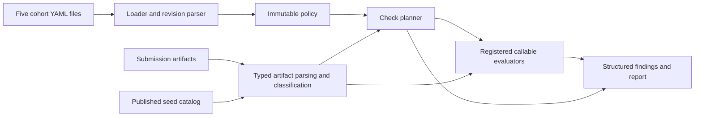

# Submission validation

`inference_endpoint.validation` validates submission artifacts against a versioned
cohort policy. The command-line entry point is `inference-endpoint-validation`.



## Execution

```python
from pathlib import Path

from inference_endpoint.validation import validate_submission

report = validate_submission(Path("submissions/acme/submission-1"))
for finding in report.errors:
    print(finding.rule, finding.message)
```

```sh
uv run inference-endpoint-validation --submission submissions/acme/submission-1
uv run inference-endpoint-validation path/to/2026-10-C1 --submission submissions/acme/submission-1
```

The API accepts a loaded `Policy` or policy directory through its `policy` keyword.
`SubmissionChecker` stores configuration; each `run()` parses fresh evidence.
Execution classifies subjects, selects rules and exceptions, resolves prerequisites,
and invokes callable evaluator classes with effective YAML requirements. Region
and power facts use the effective rules for their selected subjects. Disabled or
failed derivations cannot satisfy dependent checks. Check selection and compliance
evaluation are separate stages.

Checks register by `CheckKind` through `Evaluator.__init_subclass__`. An evaluator
receives a `PlannedCheck` and parsed artifacts and returns explicit findings. It does
not identify behavior by a rule's name. Adding another check of an existing kind
requires a YAML definition; adding a new operation requires its evaluator and
versioned parser contract. Evidence models support safe repeated validation;
compliance findings come from the selected evaluators.

Exit code 1 indicates errors, or warnings with `--strict`. Blocked mandatory checks
are errors and cannot produce a passing submission. Invalid artifacts, unavailable
required catalogs, unsupported operations, and missing approval data fail visibly.
The CLI report includes cohort version, revision, and policy digest.

Seed values come from the bundled published cohort catalog and are not duplicated
in validation policies. Approved speculative decoding heads come from the selected
cohort policy. Submission validation accepts no catalog path or environment
overrides. Client revision approval requires the
`git_sha` in each point's `result_summary.json` to exactly match an entry in
`approved_client_revisions`. No Git checkout or network access is required.
An empty approval list blocks the check. Checkpoint approvals require the model,
repository, and full revision to match. The bundled client approval list requires
published values before that rule can approve submissions.

## Policy bundles

The cohort directory contains:

| File                   | Contents                                                                     |
| ---------------------- | ---------------------------------------------------------------------------- |
| catalog.yaml           | Models, datasets, thresholds, enrollment, exceptions and catalog diagnostics |
| submission_checks.yaml | Submission and implementation checks                                         |
| system_checks.yaml     | System checks                                                                |
| curve_checks.yaml      | Model curve and collection checks                                            |
| point_checks.yaml      | Measurement point checks                                                     |

All files declare the same cohort `version` and positive integer `revision`.
The directory name matches the cohort. There is no top-level `kind` or
`schema_version`. `load_policy()` rejects incomplete bundles, duplicate keys,
noncanonical identifiers, unknown vocabulary, wrong scopes, and unresolved
references. Rules and catalogs are immutable; source hashes identify the bundle.
Datasets declare their exact `sample_count`, with `is_legacy` defaulting to false
and `sample_unit` defaulting to sample.

`BundleParser` is a callable abstract class registered through `__init_subclass__`.
Each parser declares a cohort and inclusive revision interval.
`schemas/requirements_v1.py` defines a typed contract for each check kind,
including strict flags, numeric bounds, nested operands, and operation-specific
required fields. Base rules and fully merged overrides must satisfy those
contracts before planning. `operations.py` shares operation enums between
contracts and evaluators. Overlapping intervals
and unsupported releases fail explicitly. Revision 1 is supported.

## Classification and planning

Each input file is read and parsed once. `ParsedArtifact.from_json` retains the
typed value, supplied field names, and structural errors; it discards the input
document. Supplied field names distinguish omissions from schema defaults.
Reported metric aliases remain separate from calculated metrics. Accuracy scores
accept finite numbers and finite numeric strings; booleans, malformed values,
and explicitly empty scores produce structural errors. Supplied non-null decode
head declarations select approval checks even when identity is incomplete.
Cooling uses the shared `Cooling` enum, including `mixed`, and requires a
matching policy overhead.

`PointArtifacts.from_evidence` constructs a complete point with parsed evidence
and a required classification. Calculated point power lives in `PointDerived`.
Submission indexes, loaded catalogs, and calculated collection data live in
`ArtifactIndex`, `CatalogEvidence`, and `DerivedArtifacts`, respectively.

Artifact adapters create typed `Context` objects using the client's
`LoadPatternType`. `None` denotes unknown classification; empty fact sets and false
represent known absence. Available dependencies must have passed parsing or
computation. There is no deployment-scenario classification.

Rules declare inline `applies_to`, `unless`, and `requires`. Different predicate
fields are ANDed; enum lists are alternatives. Exclusion takes precedence over
missing evidence. Unknown classification or missing prerequisites block the check.
Model-bound checks require enrollment; independent artifact checks remain eligible.

Pareto curves contain measurement points for one model on one system. Their
classification objects contain point members. Selection filters those members, and model
or load-pattern exceptions partition them. Evaluators consume only the planned
`selected_members`. Members inherit shared model/division identity while unknown
point-specific facts remain unknown. Two exceptions matching the same member are
an error.

```sh
uv run inference-endpoint-validation
uv run inference-endpoint-validation --submission ./submission
uv run pytest tests/unit/validation -q --no-cov
```

`--submission DIRECTORY` is the submission validation entry point: it reads result
artifacts, classifies runs automatically, selects checks, and executes them. Its
output contains pass/fail findings. No classification JSON is required.

Running without `--submission` inspects the policy bundle and returns its version,
revision, rule count, and source hashes. Inspection returns exit code 0 when it
successfully produces output. Submission execution obtains classification from
artifacts and reports validation findings.
[Policy coverage](README.md) lists the supported check definitions.

Metrics snapshots use one typed msgspec decoder. Wire verdicts use canonical enum
values; malformed or noncanonical frames follow the codec's decode-error handler.

## Module ownership

`evidence/` defines artifact schemas and loaders. It normalizes native field
representations and reports structural parsing errors; compliance checks belong
in `checks/`. `results.py` defines findings and submission reports using the shared
severity enum. `catalogs/` holds the published seed catalog and its loader, while
`cohorts.py` supplies publication-calendar arithmetic.

`power/models.py` defines descriptor schemas and calculation results.
`power/calculation.py` computes power from an explicit descriptor and effective
cohort policy values. The calculator keeps policy state separate from artifact
models. The power evaluators select subjects and turn calculation findings into
validation results.

Lower-priority CLI work is tracked in [Follow-ups](follow-ups.md).
